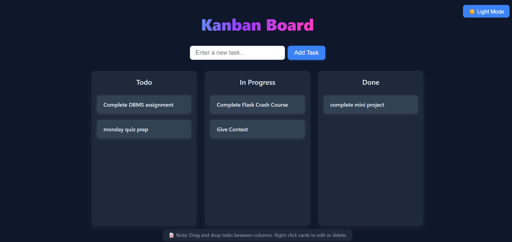
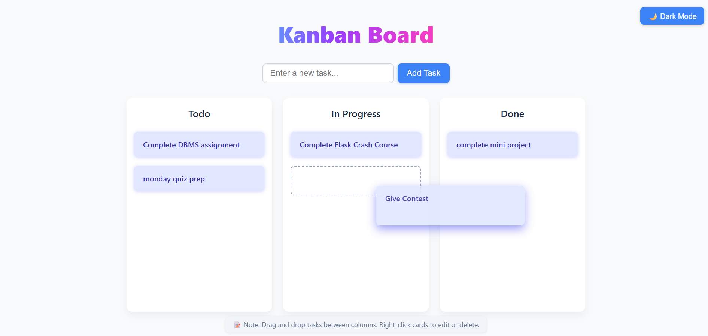

# Kanban Board

A web-based Kanban Board app to manage tasks with drag-and-drop functionality, task editing, deleting, and a dark/light theme toggle.

---

## Live Demo

Check out the live Kanban Board project [here](https://kanban-board-alpha-lovat.vercel.app/).

---

## Key JavaScript Concepts Used

### 1. Drag and Drop with Mouse Events
- Uses `mousedown`, `mousemove`, and `mouseup` events to implement custom drag-and-drop for task cards.
- On `mousedown`, the card starts dragging if the left mouse button is clicked (`e.button === 0`).
- The card position is updated continuously with `mousemove` to follow the cursor.
- On `mouseup`, dragging stops and the card is dropped into the new column position.
- A `placeholder` element is dynamically inserted to show where the card will be dropped.

### 2. Event Delegation and Listeners
- Cards listen to `contextmenu` event (right-click) to show a **custom context menu** for editing or deleting tasks.
- The menu uses event listeners for hover effects and click handlers for edit/delete.
- `click` event on the document hides the menu if clicking outside.

### 3. DOM Manipulation
- New tasks are added dynamically to the first column by creating and appending new `.card` elements.
- The card’s content and styles are manipulated via DOM APIs like `.textContent`, `.classList`, `.style`, `.appendChild`, and `.remove()`.

### 4. Preventing Default Behavior
- Default drag-and-drop behavior is disabled with `dragstart` event’s `e.preventDefault()` to allow custom dragging.
- The right-click menu’s default context menu is prevented with `e.preventDefault()`.

### 5. Timers to Handle Click/Dblclick Distinction
- Uses `setTimeout` and `clearTimeout` to prevent drag start on double-clicks.

---

## Dark Mode Toggle

- The button with `id="theme-toggle"` toggles the `.dark-theme` class on the `<body>`.
- CSS uses `.dark-theme` class selectors to change colors of columns, cards, text, and custom context menu.
- The toggle button text changes dynamically between "🌙 Dark Mode" and "☀️ Light Mode" based on the current theme.
- This approach uses CSS variables and class toggling for efficient theming without reloading or inline style changes.

---

## How to Use

- **Add Tasks:** Enter a task in the input box and click "Add Task".
- **Drag and Drop:** Click and hold a task card (left-click), drag it between columns, and release to drop.
- **Edit/Delete:** Right-click a card to open the custom menu to edit or delete the task.
- **Dark Mode:** Click the toggle button on the top right to switch themes.

---

## Demo Screenshot

---

